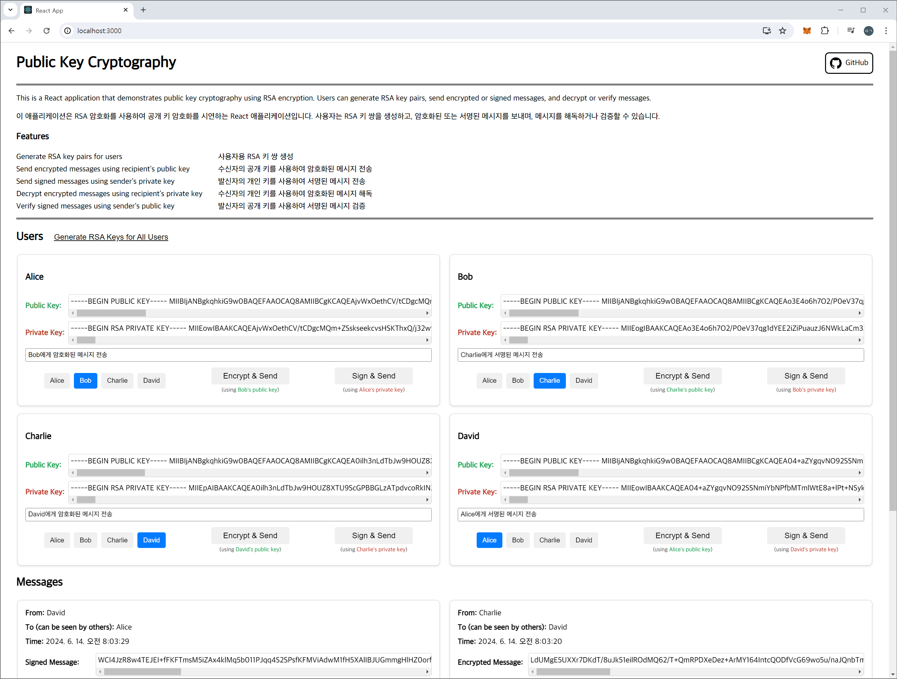
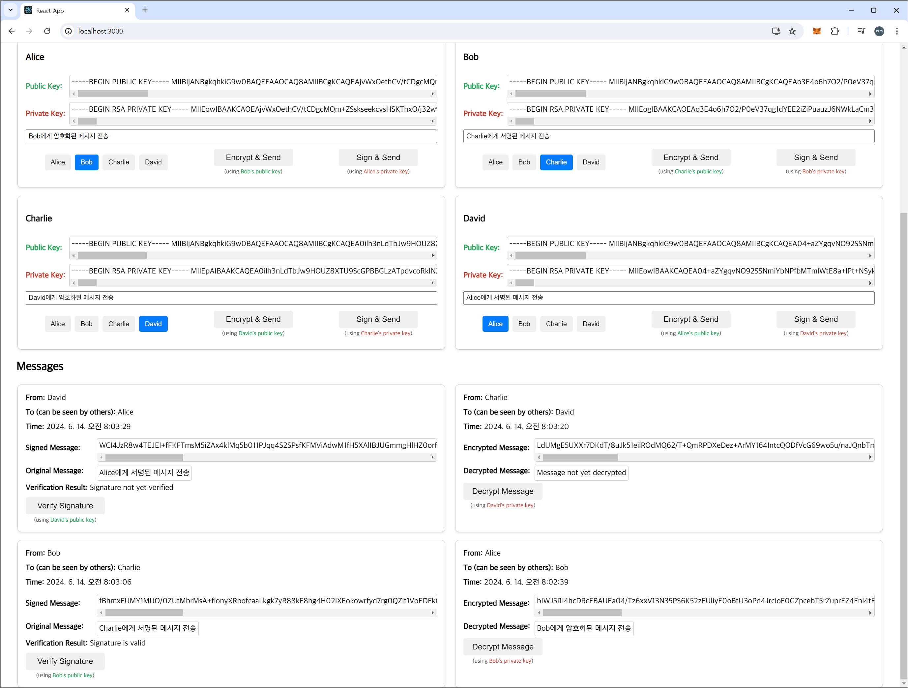

# Public Key Cryptography React App

This is a React application that demonstrates public key cryptography using RSA encryption. Users can generate RSA key pairs, send encrypted or signed messages, and decrypt or verify messages.

이 애플리케이션은 RSA 암호화를 사용하여 공개 키 암호화를 시연하는 React 애플리케이션입니다. 사용자는 RSA 키 쌍을 생성하고, 암호화된 또는 서명된 메시지를 보내며, 메시지를 해독하거나 검증할 수 있습니다.




## Requirements

- Node.js
- npm

## Getting Started

Follow these steps to set up and run the project:

1. **Clone the repository:**
  ```sh
  git clone https://github.com/2mingyu/public-key-cryptography.git
  cd public-key-cryptography
  ```
2. **Install dependencies:**
  ```sh
  npm install
  ```
3. **Start the development server:**
  ```sh
  npm start
  ```
4. **Open the application in your browser:**

The application will automatically open in your default browser. If it doesn't, you can manually open your browser and navigate to http://localhost:3000.

애플리케이션이 자동으로 기본 브라우저에서 열립니다. 열리지 않으면 브라우저를 수동으로 열고 http://localhost:3000 으로 이동할 수 있습니다.

## Features

- Generate RSA key pairs for users

- Send encrypted messages using recipient's public key

- Send signed messages using sender's private key

- Decrypt encrypted messages using recipient's private key

- Verify signed messages using sender's public key

- 사용자용 RSA 키 쌍 생성

- 수신자의 공개 키를 사용하여 암호화된 메시지 전송

- 발신자의 개인 키를 사용하여 서명된 메시지 전송

- 수신자의 개인 키를 사용하여 암호화된 메시지 해독

- 발신자의 공개 키를 사용하여 서명된 메시지 검증

## Libraries Used

### node-forge

`node-forge` is a comprehensive cryptography library for JavaScript. It provides various cryptographic algorithms and utilities, including RSA key generation, encryption/decryption, and digital signature generation/verification. `node-forge` is used in this project to generate RSA key pairs and handle encryption and decryption processes.

`node-forge`는 JavaScript용 종합 암호화 라이브러리입니다. RSA 키 생성, 암호화/복호화, 디지털 서명 생성/검증을 포함한 다양한 암호화 알고리즘과 유틸리티를 제공합니다. 이 프로젝트에서는 RSA 키 쌍을 생성하고 암호화 및 복호화 과정을 처리하기 위해 `node-forge`를 사용합니다.